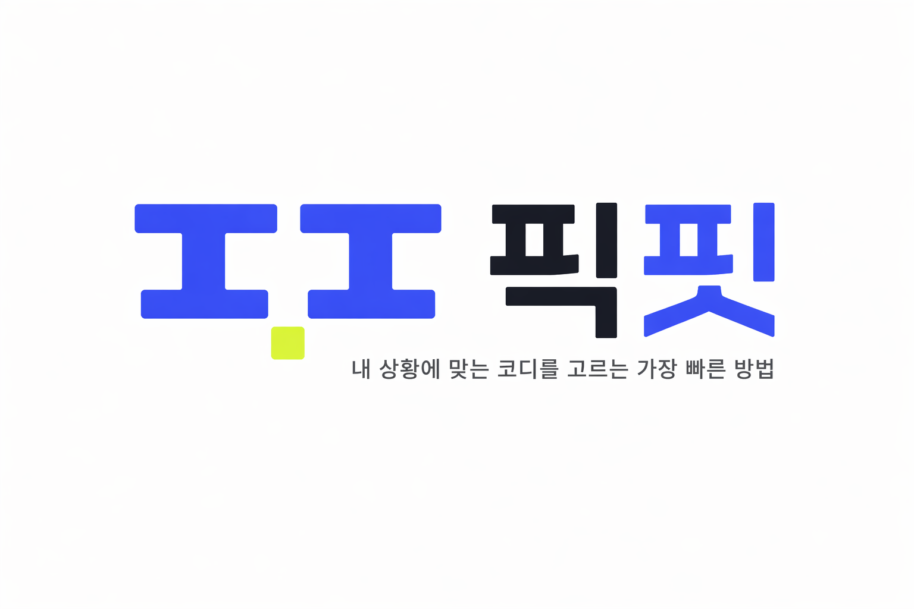
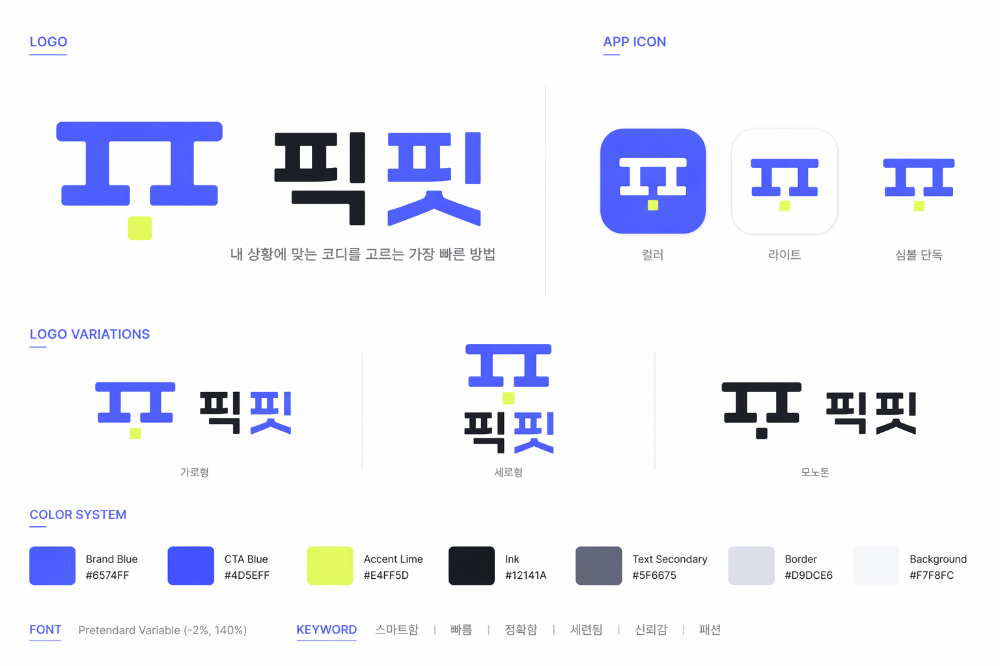

# PickFit

<p align="center">
  
</p>

<p align="center">
  <strong>상황에 맞는 코디를 빠르게 골라주는 패션 결정 앱</strong><br />
  몇 가지 질문만으로 사용자의 상황, 취향, 예산, 체형 고민을 정리하고 구매 직전까지 필요한 코디 후보를 추천하는 웹 앱 프로토타입입니다.
</p>

<p align="center">
  <a href="#핵심-가치">핵심 가치</a> ·
  <a href="#주요-기능">주요 기능</a> ·
  <a href="#기술-스택">기술 스택</a> ·
  <a href="#실행-방법">실행 방법</a>
</p>

---

## Preview

| Brand System | Logo Lockup |
| --- | --- |
|  |  |

## 핵심 가치

PickFit은 일반적인 상품 탐색 앱이 아니라 **패션 구매 결정을 끝내는 decision engine**을 지향합니다.

- **Decision over Discovery**: 끝없는 탐색보다 빠른 결정에 집중합니다.
- **Outfit over Item**: 단품보다 상황에 맞는 전체 코디를 추천 단위로 둡니다.
- **Explainability first**: 추천 이유, 반영 조건, 리뷰 근거, 핏 리스크를 함께 보여줍니다.
- **Trust UX**: 데이터가 부족하거나 불확실한 부분은 숨기지 않고 사용자에게 명확히 알립니다.

## 주요 기능

- 상황 기반 시작 화면
- 5~7문항의 빠른 온보딩 플로우
- 예산, 무드, 핏, 체형 고민, 선호 색상 입력
- 추천 생성 진행 상태 UI
- 코디 추천 결과 카드
- 코디별 구성 상품, 가격, 추천 이유, 리스크 표시
- 추천 코디 비교 화면
- 상품 상세 및 구매 링크 이동 준비 화면
- 저장한 코디와 피드백 관리

## 기술 스택

### 현재 프로토타입

| 영역 | 기술 |
| --- | --- |
| Frontend | HTML5, Vanilla JavaScript ES Modules |
| Styling | Tailwind CSS CDN, Custom CSS Design Tokens |
| Font | Pretendard Variable, Black Han Sans |
| State | LocalStorage 기반 클라이언트 상태 관리 |
| Data | JavaScript mock catalog / mock outfit data |
| Assets | PNG logo assets, WebP product images |

### 확장 목표

| 영역 | 계획 |
| --- | --- |
| Backend | PHP 8.2+, PDO, JSON API |
| Database | MySQL 8, normalized product/review schema |
| AI | OpenAI Responses API, Structured Outputs |
| Crawling | Playwright Chromium CLI worker |
| Testing | PHPUnit, Playwright smoke/E2E tests |
| Build | Tailwind CLI, npm tooling |

## 프로젝트 구조

```text
.
├── index.html
├── css/
│   └── styles.css
├── js/
│   ├── app.js
│   ├── components/
│   ├── data/
│   ├── screens/
│   └── utils/
├── assets/
│   ├── img/
│   └── products/
├── img/
│   └── logo/
├── LOGO/
├── docs/
│   └── images/
├── PickFit.md
├── design_system.md
├── tech.md
└── development_10day_plan.md
```

## 실행 방법

PHP 백엔드 + MySQL이 필요합니다. (정적 서버로 루트를 열면 동작하지 않습니다 — 앱은 `public/`에 있고 PHP 프론트 컨트롤러가 서빙합니다.)

1. MySQL을 실행하고 `pickfit` 데이터베이스를 준비합니다. (마이그레이션 적용, 카탈로그는 `database/seeds/musinsa_catalog_seed.sql` 로 복원 가능)
2. 앱 서버를 시작합니다:

```bash
npm run dev   # php -S 127.0.0.1:8000 -t public public/index.php
```

3. 브라우저에서 아래 주소를 엽니다.

```text
http://127.0.0.1:8000
```

## 디자인 시스템

PickFit의 브랜드 방향은 **Urban Smart Fashion Utility**입니다.

| Token | Value | Usage |
| --- | --- | --- |
| Brand Blue | `#6574FF` | 로고, 브랜드 그래픽, 주요 하이라이트 |
| CTA Blue | `#4D5EFF` | 주요 버튼, 선택 상태, 진행 표시 |
| Accent Lime | `#E4FF5D` | 배지, 추천 포인트, 마이크로 액센트 |
| Ink | `#12141A` | 제목, 핵심 정보 |
| Background | `#F7F8FC` | 기본 앱 배경 |

## 로드맵

- PHP/MySQL 기반 API 서버 도입
- mock catalog를 seed database로 전환
- deterministic fallback recommendation 구현
- OpenAI Structured Outputs 기반 추천 생성
- 저장/피드백 데이터 영속화
- Playwright 기반 상품 URL 분석 모듈 추가
- 모바일/데스크톱 반응형 QA 및 E2E 테스트 보강

## 관련 문서

- [PickFit.md](PickFit.md): 제품 방향성과 MVP 범위
- [design_system.md](design_system.md): UI/UX 디자인 시스템
- [tech.md](tech.md): 백엔드, DB, AI, 크롤링 확장 기술 명세
- [development_10day_plan.md](development_10day_plan.md): 개발 일정 계획

